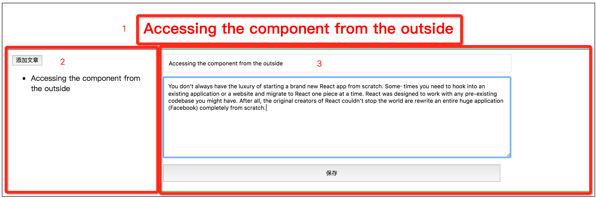
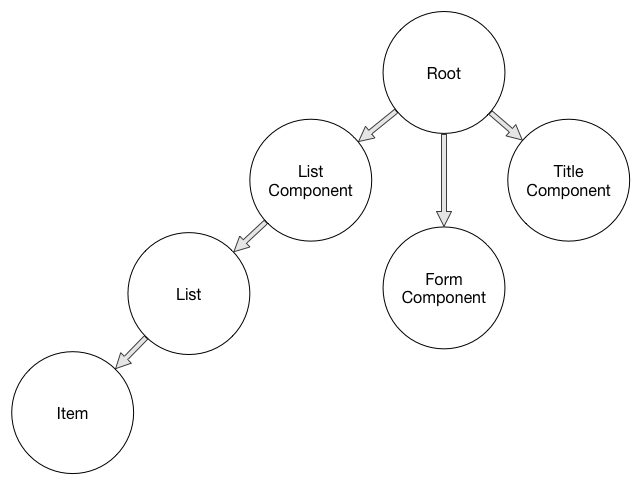

# React example

样例中包含三种框架的实现, 分别是jQuery, Angular, React(ES5)。

## 样例项目介绍

样例是一个简单的文章编辑器。界面分为四个组件。

1. 首先外部黑色边框代码是其他三个组件的父级（Root Container）
2. 标题组件（红色数字1指示的位置）（Title Component）
3. 文章列表组件（红色数字2指示的位置）（List Component）
4. 文章编辑组件（红色数字3指示的位置）（Form Component）

组件交互关系：

1. 文章列表的文章可以点击选择，同时显示文章标题（标题组件）和文章内容（编辑组件）
2. 添加文案按钮点击，清空文章标题（标题组件）和文章内容（编辑组件）
3. 编辑组件的标题输入组件和内容输入组件可以添加（更新）内容，点击保存按钮后，刷新文章列表（列表组件）和文章标题（标题组件）

请分别进入三个样例目录运行样例程序查看效果。